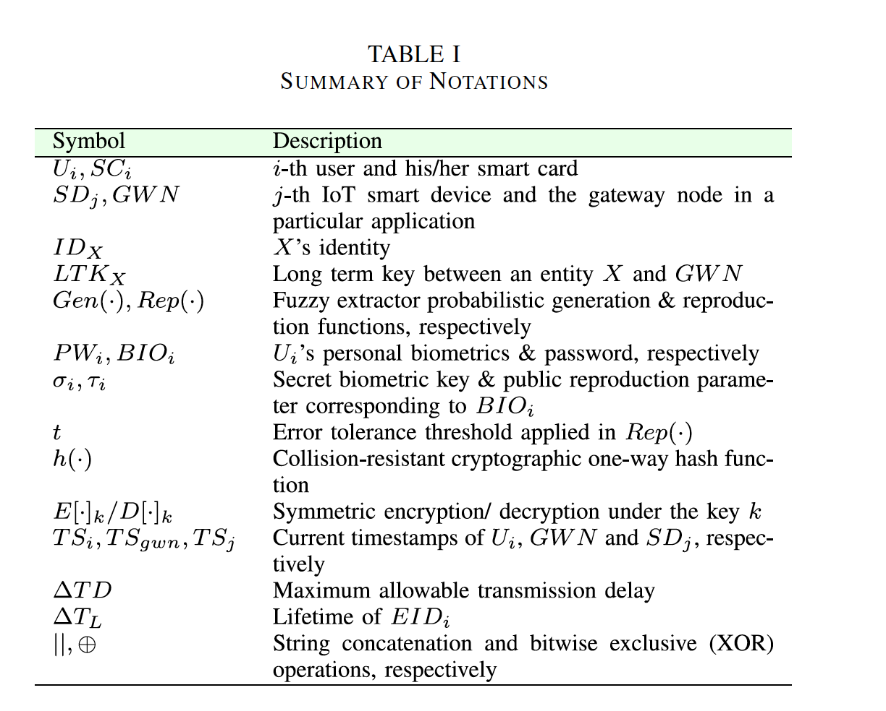
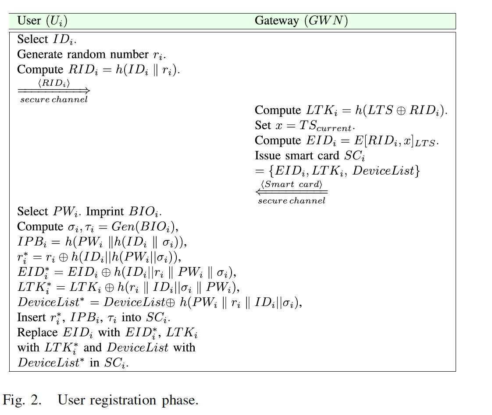
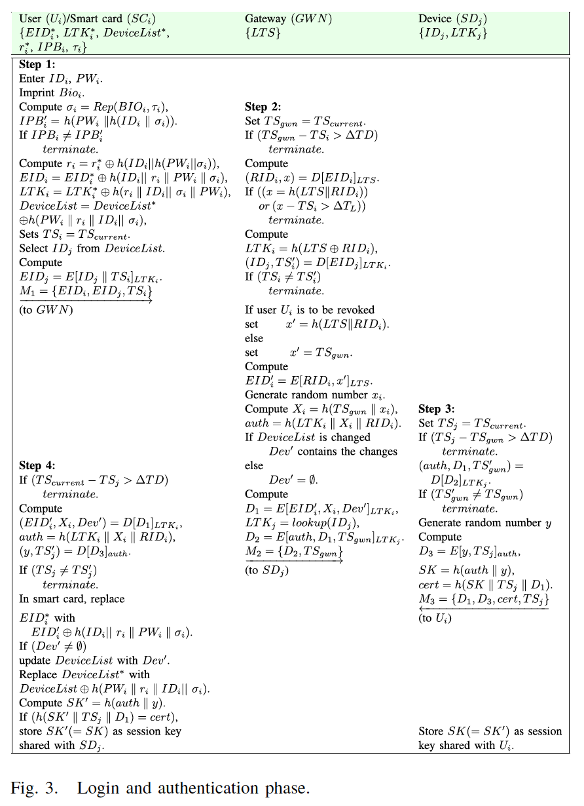

# HLPSL

## A Provably Secure and Lightweight Anonymous User Authenticated Session Key Exchange Scheme for Internet of Things Deployment

### Agents involved: A, B and C
  - A : User
  - B : Server/GateWay Node(GWN)
  - C : Sensor

### Stages:
  1. Notations:
    

  2. Registration 
     - User &#8594; GWN
     - GWN &#8594; User
     - Sensor &#8594; GWN
     - GWN &#8594; Sensor
     
  3. Login and authentication phase.
     - User &#8594; Sensor
     

### We focus on designing a new lightweight user authentication protocol suited for IoT architecture, which will also achieve anonymity and untraceability. We have implemented the following phase :
#### 1) User Registration Phase
#### 2) Login and User Authentication Phase

### Roles: 
  1. user ( A, B, C : agent, H : hash_func, S,E,D: symmetric_key, SND, RCV : channel(dy) )
     - User Registration
     - User receiving smard card from server with password
     - User ssending login request to server
     - User receiving message from smart device  

  2. sensor ( A, B, C : agent, H : hash_func, S,E,D: symmetric_key, SND, RCV : channel(dy) )
     - Device sends message to user

  3. server ( A, B, C : agent, H : hash_func, S: symmetric_key, SND, RCV : channel(dy) )
     - Server receives RID for registration and send smart card to user 
     - sensor request to server to authenticate that the data received is from assumed user 

### Goals: 
  1. Secrecy of random nonces are maintained
  2. Authentication is secure 

